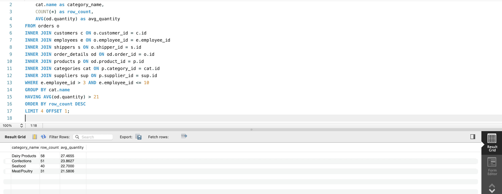

# LibraryManagement Database

## Task 1

База даних ["LibraryManagement"](db.sql) містить наступні таблиці:

- **authors** - інформація про авторів книг
- **genres** - жанри літератури
- **books** - інформація про книги з посиланнями на авторів та жанри
- **users** - користувачі бібліотеки
- **borrowed_books** - записи про позичені книги

## Task 2

Всі таблиці містять тестові дані для демонстрації роботи системи.

### Скріншоти таблиць:

#### Таблиця authors


#### Таблиця genres


#### Таблиця books


#### Таблиця users


#### Таблиця borrowed_books


## Task 3

Запит, що об'єднує всі таблиці бази даних e-commerce системи за допомогою операторів FROM та INNER JOIN:

```sql
SELECT
    o.id as order_id,
    o.date as order_date,
    c.name as customer_name,
    c.country as customer_country,
    CONCAT(e.first_name, ' ', e.last_name) as employee_name,
    s.name as shipper_name,
    p.name as product_name,
    p.price as product_price,
    p.unit as product_unit,
    od.quantity,
    cat.name as category_name,
    sup.name as supplier_name,
    sup.country as supplier_country
FROM orders o
INNER JOIN customers c ON o.customer_id = c.id
INNER JOIN employees e ON o.employee_id = e.employee_id
INNER JOIN shippers s ON o.shipper_id = s.id
INNER JOIN order_details od ON od.order_id = o.id
INNER JOIN products p ON od.product_id = p.id
INNER JOIN categories cat ON p.category_id = cat.id
INNER JOIN suppliers sup ON p.supplier_id = sup.id;
```


## Task 4

### 1. Підрахунок кількості рядків у базовому запиті

```sql
SELECT COUNT(*) as total_rows
FROM orders o
INNER JOIN customers c ON o.customer_id = c.id
INNER JOIN employees e ON o.employee_id = e.employee_id
INNER JOIN shippers s ON o.shipper_id = s.id
INNER JOIN order_details od ON od.order_id = o.id
INNER JOIN products p ON od.product_id = p.id
INNER JOIN categories cat ON p.category_id = cat.id
INNER JOIN suppliers sup ON p.supplier_id = sup.id;
```


### 2. Зміна INNER JOIN на LEFT/RIGHT JOIN

```sql
SELECT COUNT(*) as total_rows
FROM orders o
INNER JOIN customers c ON o.customer_id = c.id
LEFT JOIN employees e ON o.employee_id = e.employee_id
RIGHT JOIN shippers s ON o.shipper_id = s.id
LEFT JOIN order_details od ON od.order_id = o.id
RIGHT JOIN products p ON od.product_id = p.id
LEFT JOIN categories cat ON p.category_id = cat.id
INNER JOIN suppliers sup ON p.supplier_id = sup.id;
```


**Пояснення:** Кількість рядків залишається такою ж, як і при INNER JOIN, тому що всі записи в таблицях мають відповідні зв'язки (немає NULL значень у зовнішніх ключах). LEFT та RIGHT JOIN показують той самий результат, що й INNER JOIN, коли всі дані повністю відповідають один одному.

### 3. Фільтрація за employee_id > 3 та ≤ 10

```sql
SELECT
    o.id as order_id,
    o.date as order_date,
    c.name as customer_name,
    c.country as customer_country,
    CONCAT(e.first_name, ' ', e.last_name) as employee_name,
    s.name as shipper_name,
    p.name as product_name,
    p.price as product_price,
    p.unit as product_unit,
    od.quantity,
    cat.name as category_name,
    sup.name as supplier_name,
    sup.country as supplier_country
FROM orders o
INNER JOIN customers c ON o.customer_id = c.id
INNER JOIN employees e ON o.employee_id = e.employee_id
INNER JOIN shippers s ON o.shipper_id = s.id
INNER JOIN order_details od ON od.order_id = o.id
INNER JOIN products p ON od.product_id = p.id
INNER JOIN categories cat ON p.category_id = cat.id
INNER JOIN suppliers sup ON p.supplier_id = sup.id
WHERE e.employee_id > 3 AND e.employee_id <= 10;
```


### 4. Групування за категорією з підрахунком та середньою кількістю

```sql
SELECT
    cat.name as category_name,
    COUNT(*) as row_count,
    AVG(od.quantity) as avg_quantity
FROM orders o
INNER JOIN customers c ON o.customer_id = c.id
INNER JOIN employees e ON o.employee_id = e.employee_id
INNER JOIN shippers s ON o.shipper_id = s.id
INNER JOIN order_details od ON od.order_id = o.id
INNER JOIN products p ON od.product_id = p.id
INNER JOIN categories cat ON p.category_id = cat.id
INNER JOIN suppliers sup ON p.supplier_id = sup.id
WHERE e.employee_id > 3 AND e.employee_id <= 10
GROUP BY cat.name;
```


### 5. Фільтрація за середньою кількістю > 21

```sql
SELECT
    cat.name as category_name,
    COUNT(*) as row_count,
    AVG(od.quantity) as avg_quantity
FROM orders o
INNER JOIN customers c ON o.customer_id = c.id
INNER JOIN employees e ON o.employee_id = e.employee_id
INNER JOIN shippers s ON o.shipper_id = s.id
INNER JOIN order_details od ON od.order_id = o.id
INNER JOIN products p ON od.product_id = p.id
INNER JOIN categories cat ON p.category_id = cat.id
INNER JOIN suppliers sup ON p.supplier_id = sup.id
WHERE e.employee_id > 3 AND e.employee_id <= 10
GROUP BY cat.name
HAVING AVG(od.quantity) > 21;
```


### 6. Сортування за спаданням кількості рядків

```sql
SELECT
    cat.name as category_name,
    COUNT(*) as row_count,
    AVG(od.quantity) as avg_quantity
FROM orders o
INNER JOIN customers c ON o.customer_id = c.id
INNER JOIN employees e ON o.employee_id = e.employee_id
INNER JOIN shippers s ON o.shipper_id = s.id
INNER JOIN order_details od ON od.order_id = o.id
INNER JOIN products p ON od.product_id = p.id
INNER JOIN categories cat ON p.category_id = cat.id
INNER JOIN suppliers sup ON p.supplier_id = sup.id
WHERE e.employee_id > 3 AND e.employee_id <= 10
GROUP BY cat.name
HAVING AVG(od.quantity) > 21
ORDER BY row_count DESC;
```


### 7. Вибірка чотирьох рядків з пропуском першого

```sql
SELECT
    cat.name as category_name,
    COUNT(*) as row_count,
    AVG(od.quantity) as avg_quantity
FROM orders o
INNER JOIN customers c ON o.customer_id = c.id
INNER JOIN employees e ON o.employee_id = e.employee_id
INNER JOIN shippers s ON o.shipper_id = s.id
INNER JOIN order_details od ON od.order_id = o.id
INNER JOIN products p ON od.product_id = p.id
INNER JOIN categories cat ON p.category_id = cat.id
INNER JOIN suppliers sup ON p.supplier_id = sup.id
WHERE e.employee_id > 3 AND e.employee_id <= 10
GROUP BY cat.name
HAVING AVG(od.quantity) > 21
ORDER BY row_count DESC
LIMIT 4 OFFSET 1;
```


